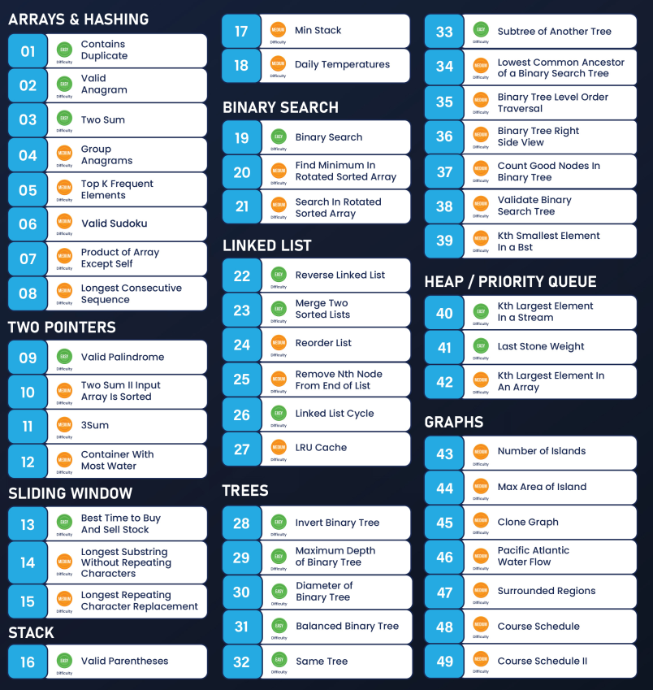

# leetcode-cpp

This is the plan:

- [NeetCode's list](https://docs.google.com/spreadsheets/u/0/d/1A2PaQKcdwO_lwxz9bAnxXnIQayCouZP6d-ENrBz_NXc/htmlview)
- [My List](https://docs.google.com/spreadsheets/d/14dZ0WArVccGCKqX-Wm6_oUX1W7ne3ejNBRN2CbCbkD0/edit?usp=sharing)
- [Another Roadmap](https://instabyte.io/p/dsa-master)

Cool Patterns:
- How to utilize index decrement of a linear data structure to write recursively: recursion/get_node.py